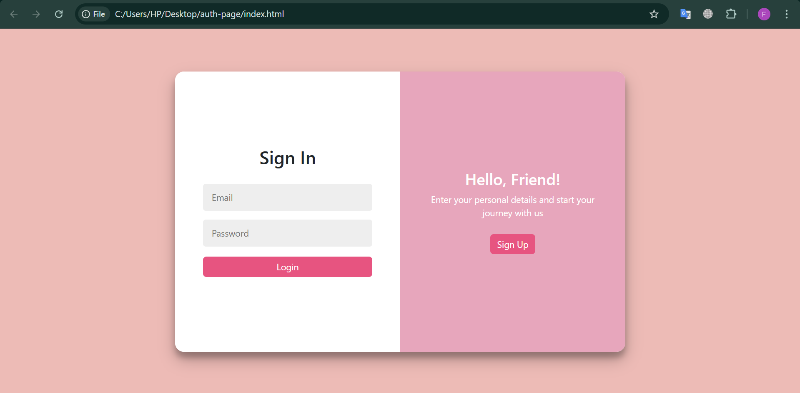
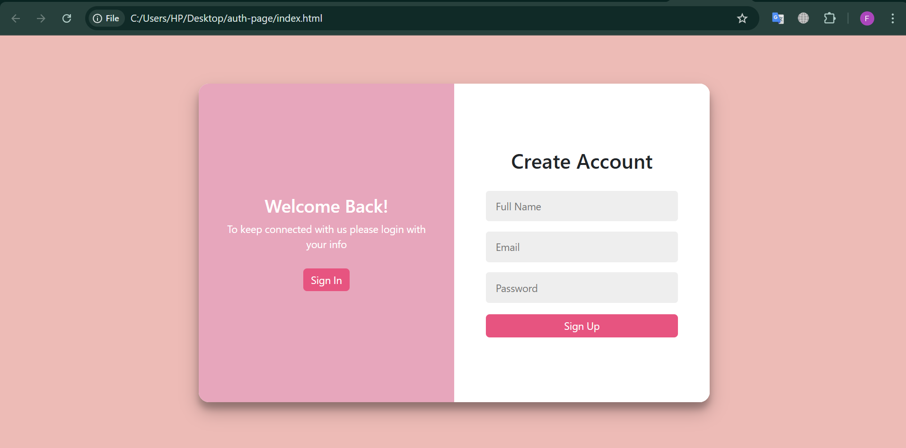

# Login and Signup Page 🌐

A simple and responsive login and signup page created using **HTML** and **CSS**. This project demonstrates how to build clean and modern authentication interfaces for web applications.

---

## 🔥 Features

- Swipe left-right forms
- Clean and minimal user interface
- Separate login and signup forms
- CSS animations for transitions

---

## 🛠️ Technologies Used

- HTML5
- CSS3 (Flexbox, Media Queries)

---

📸 Screenshots
🖥️ Login Page

📝 Signup Page

## 🚀 Getting Started

Clone the repository:
   ```bash
   git clone https://github.com/your-username/your-repo-name.git

cd your-repo-name
Open index.html in your browser:
You can simply drag and drop the file in your browser
Or use a live server in VSCode


